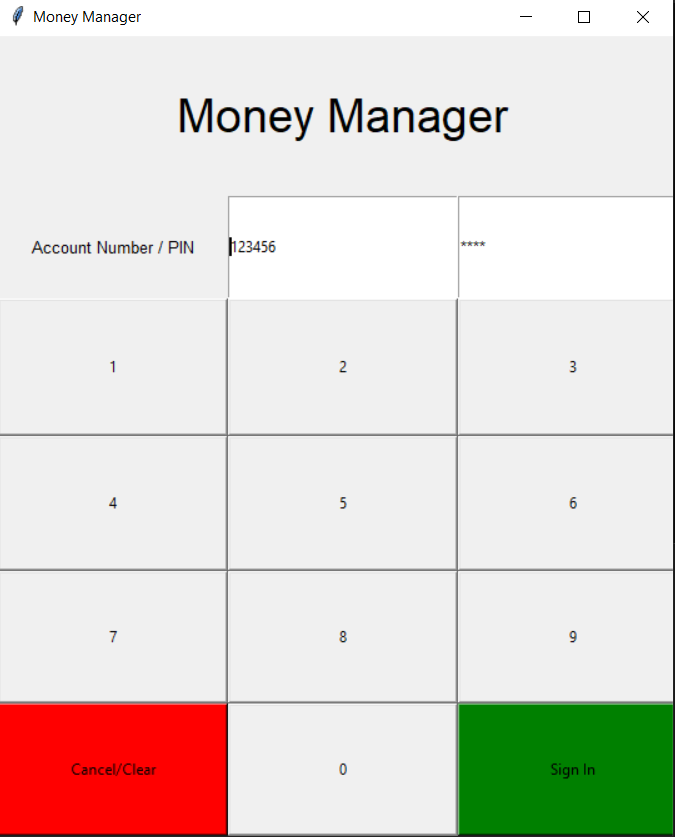

# FedUni Banking : 
A Python Tkinter Application

This is a Money Manager Application, which has a functionality of login **Account Number** and **password**.

After Logging in we have a window displaying the *Account_number*, *Current Balance*, and an entry box for both Deposit and Withdrawl, which stores the transaction string for displaying it in the *Transaction_History* window.

